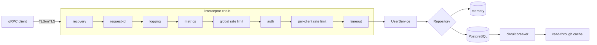

# Architecture overview

The service is a single Go binary that owns three listeners — gRPC, health HTTP
and metrics HTTP — plus an optional OTLP trace exporter.

## Listeners

| Listener | Port (default) | Purpose |
| --- | --- | --- |
| gRPC | `50051` | UserService + Health, TLS/mTLS |
| Health HTTP | `8080` | `/healthz` (liveness), `/readyz` (readiness) |
| Metrics HTTP | `9090` | `/metrics` (Prometheus, OpenMetrics exemplars) |
| OTLP/HTTP | configured | trace export (optional, sampled) |

## Design decisions

The rationale for the transport, auth, storage, observability and deployment
choices is captured in the [Architecture Decision Records](../adr/README.md).
